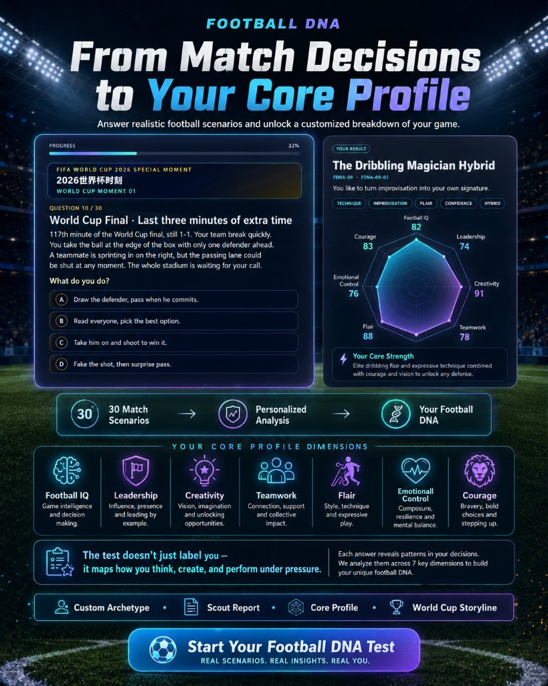
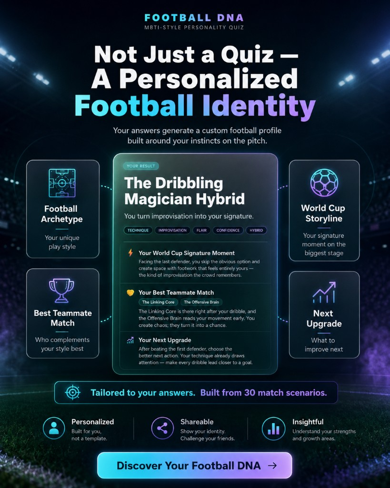

<div align="center">

# Football DNA

**An MBTI-style football personality quiz — discover your on-pitch archetype in 30 match moments.**

[🌐 Live (International)](https://soccer-mbti.kickquiz.workers.dev) · [🇨🇳 Live (China)](http://football-mbti.cn) · English / 中文 · [MIT License](LICENSE)

<br />


<sub><b>30 moments</b> · <b>7 dimensions</b> · <b>10 archetypes</b> · <b>Scout report</b> · <b>World Cup storyline</b></sub>

<br />

[](LICENSE)
[](https://react.dev/)
[](https://vitejs.dev/)
[](https://tailwindcss.com/)

</div>

---

## Highlights

| | |
|:--|:--|
| ⚽ **30 scenario questions** | Fast breaks, set pieces, World Cup knockouts, dressing-room moments |
| 🧬 **10 football archetypes** | Prime · Core · Hybrid tiers from your top dimensions |
| 📊 **7-axis player profile** | Football IQ, Leadership, Creativity, Teamwork, Flair, Emotional Control, Courage |
| 🌍 **Bilingual** | Full English / 中文 UI and question copy |
| 🚀 **Static & fast** | Scoring runs in the browser — no server required to take the quiz |
| 📤 **Built to share** | Player card PNG, WeChat / Xiaohongshu / Douyin / Dongqiudi captions |

---

## Product tour

<p align="center">
  
  <br /><b>Match scenarios → personalized analysis</b><br /><sub>30 football situations · 7 core dimensions · radar profile</sub>
</p>

<table>
  <tr>
    <td align="center" width="50%">
      
      <br /><b>Scout Report</b><br /><sub>Strengths · risks · tactical fit · growth advice</sub>
    </td>
    <td align="center" width="50%">
      
      <br /><b>Football Identity</b><br /><sub>Archetype · World Cup storyline · best teammate · next upgrade</sub>
    </td>
  </tr>
</table>

---

## Live demos

| Region | URL | Hosting |
|--------|-----|---------|
| 🌐 International | https://soccer-mbti.kickquiz.workers.dev | Cloudflare Workers |
| 🇨🇳 China | http://football-mbti.cn | Aliyun OSS + custom domain |

> Aliyun OSS default bucket URLs force-download HTML. A **custom domain** bound to the bucket is required for browser access in China.

---

## How it works

```
Intro → 30 questions (shuffled) → Score in browser → Result page
                                              ↓
                    Archetype · Scout report · Radar · Share card
```

1. **Answer** — pick the choice closest to your real instinct in each match moment  
2. **Score** — pair-based lookup + 7-axis vector similarity vs. prototype profiles  
3. **Reveal** — archetype tier, scout report, World Cup extras, downloadable player card  

---

## The 10 archetypes

| Code | English | 中文 |
|------|---------|------|
| FDNA-01 | The Defensive Commander | 防线指挥官 |
| FDNA-02 | The Offensive Brain | 进攻大脑 |
| FDNA-03 | The Deep Organizer | 后场组织者 |
| FDNA-04 | The Wing Threat | 边路爆点 |
| FDNA-05 | The Inspired Attacker | 灵感攻击手 |
| FDNA-06 | The Team Anchor | 球队后盾 |
| FDNA-07 | The Clutch Captain | 关键队长 |
| FDNA-08 | The Linking Core | 串联核心 |
| FDNA-09 | The Dribbling Magician | 盘带魔术师 |
| FDNA-10 | The Tempo Master | 节奏大师 |

Each archetype resolves as **Prime**, **Core**, or **Hybrid** depending on how clearly your top dimensions separate.

---

## Quick start

**Prerequisites:** Node.js 20+ · npm 9+

```bash
git clone https://github.com/Boyuedu/football-mbti-quiz.git
cd football-mbti-quiz
npm ci
cp .env.example .env   # optional — see Environment variables
npm run dev
```

Open http://localhost:5173

```bash
npm run build    # → dist/
npm run preview  # preview production bundle
```

---

<details>
<summary><b>Environment variables</b></summary>

Copy `.env.example` to `.env` at the project root.

| Variable | Required | Description |
|----------|----------|-------------|
| `VITE_SUPABASE_URL` | Optional | Supabase project URL (`https://xxx.supabase.co`) — **not** `/rest/v1/` |
| `VITE_SUPABASE_ANON_KEY` | Optional | Anon key; enables completion counter on result page |
| `ALIYUN_OSS_REGION` | Deploy only | e.g. `oss-cn-hongkong` |
| `ALIYUN_OSS_BUCKET` | Deploy only | OSS bucket name |
| `ALIYUN_OSS_ACCESS_KEY_ID` | Deploy only | RAM access key |
| `ALIYUN_OSS_ACCESS_KEY_SECRET` | Deploy only | RAM secret |
| `ALIYUN_OSS_PREFIX` | Optional | Folder prefix inside bucket |

Without Supabase vars, the quiz works fully; the completion counter is hidden.

**Supabase setup:** run `supabase/migrations/20250611000000_quiz_counter.sql`, then add URL + anon key before `npm run build`.

</details>

<details>
<summary><b>Deployment</b></summary>

One `dist/` build deploys to two regions.

**International — Cloudflare Workers**

```bash
npm run build && npx wrangler login && npm run deploy:cloudflare
```

Config: `wrangler.toml` · Actions: `.github/workflows/deploy-cloudflare.yml` (manual trigger)

**China — Aliyun OSS**

1. Public-read bucket · static website (`index.html` + 404 → `index.html`, error code **200**)
2. Fill Aliyun vars in `.env`
3. `npm run deploy:china`
4. Bind custom domain + CNAME

Actions: `.github/workflows/deploy-china.yml` (auto on push to `main` when secrets are set)

Guides: [Dual-region deployment](docs/deployment-dual-static.md) · [Deploy with Git](docs/deploy-with-git.md) · [Scoring weights](docs/scoring-weights-reference.md)

</details>

<details>
<summary><b>Project structure</b></summary>

```
football-mbti-quiz/
├── src/
│   ├── app/                 # App shell & stage routing
│   ├── components/
│   │   ├── intro/           # Landing screen
│   │   ├── quiz/            # Question flow
│   │   ├── result/          # Result page modules
│   │   └── common/          # Language toggle, progress bar
│   ├── data/
│   │   ├── questions.js     # 30 quiz questions & dimension keys
│   │   ├── archetypes/      # Prototypes, results, scout reports
│   │   └── content/         # Result extra sections (World Cup, etc.)
│   ├── i18n/                # UI strings, localization helpers
│   └── lib/
│       ├── scoring/         # scoreAnswers, userVector, similarity
│       ├── share/           # Platform share formats & card export
│       ├── quiz/            # Question ordering, completion counter
│       └── supabase/        # Supabase client
├── scripts/                 # OSS deploy, weight export
├── supabase/migrations/     # Completion counter SQL
├── docs/                    # Deployment & scoring docs
└── .github/workflows/       # CI deploy workflows
```

</details>

<details>
<summary><b>Scripts &amp; tech stack</b></summary>

| Command | Description |
|---------|-------------|
| `npm run dev` | Start Vite dev server |
| `npm run build` | Production build → `dist/` |
| `npm run preview` | Preview `dist/` locally |
| `npm run deploy:cloudflare` | Build + deploy to Cloudflare Workers |
| `npm run deploy:china` | Build + upload to Aliyun OSS |
| `npm run export:weights` | Export scoring weight matrix |

| Layer | Choice |
|-------|--------|
| UI | React 18, Tailwind CSS 3, Framer Motion |
| Build | Vite 5 |
| Analytics counter | Supabase (PostgreSQL + RPC) |
| International CDN | Cloudflare Workers |
| China CDN | Aliyun OSS + custom domain |

</details>

---

## Contributing

Contributions are welcome under the [MIT License](LICENSE).

- **Bug reports & ideas** — [GitHub Issues](https://github.com/Boyuedu/football-mbti-quiz/issues)
- **Pull requests** — fork, branch, PR; keep changes focused

---

## 中文简介

**Football DNA（足球 DNA）** 是一款 MBTI 风格的足球人格测试：30 道比赛情境题，测出 **10 大球员原型**，并生成教练报告、七维雷达图、可下载球员卡和多平台分享文案。

| 链接 | 说明 |
|------|------|
| [海外版](https://soccer-mbti.kickquiz.workers.dev) | Cloudflare 全球加速 |
| [国内版](http://football-mbti.cn) | 阿里云 OSS + 自定义域名 |

`npm ci && npm run dev` · 部署见 [docs/deployment-dual-static.md](docs/deployment-dual-static.md)

---

## License

MIT — see [LICENSE](LICENSE). Quiz copy and archetype content are part of the project; derivative works should retain the copyright notice.

---

<div align="center">

Inspired by football culture and MBTI-style personality frameworks — for entertainment and self-reflection, not clinical assessment.

<br />

<sub>Built with ⚽ for the World Cup season</sub>

</div>
