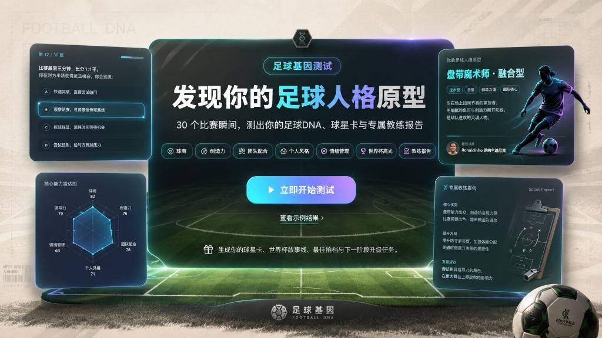
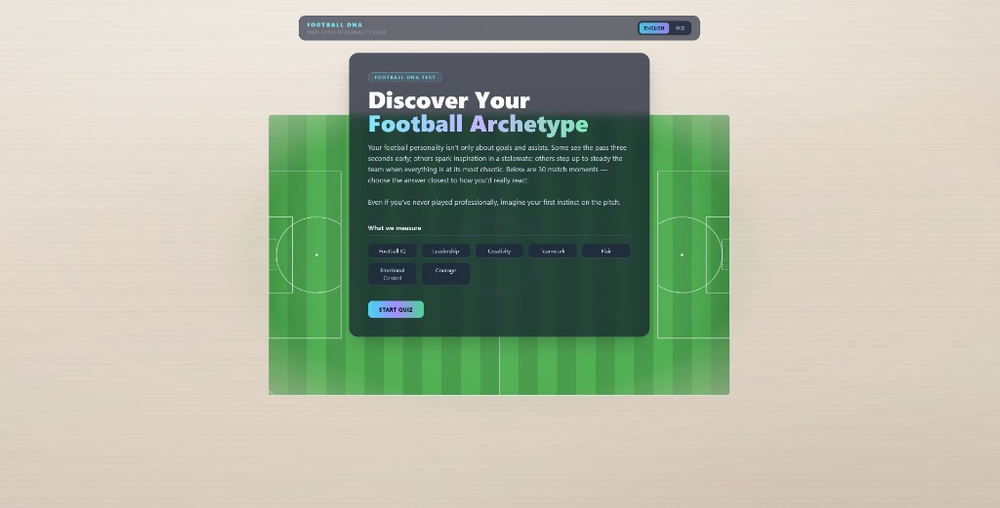
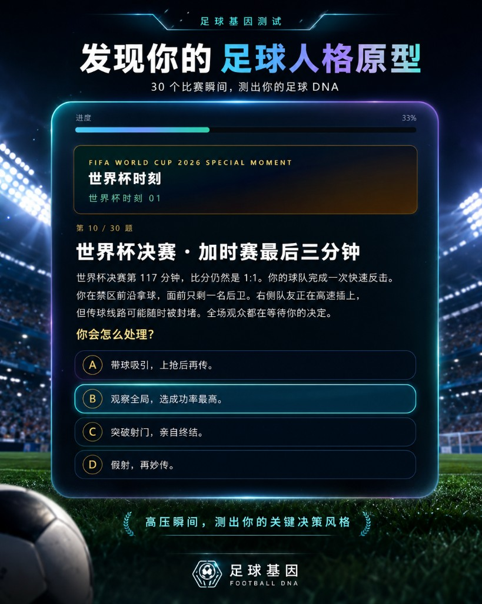
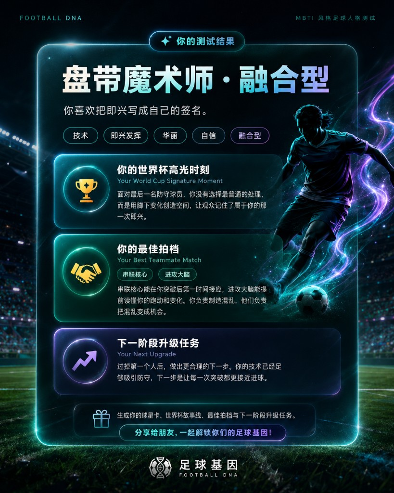
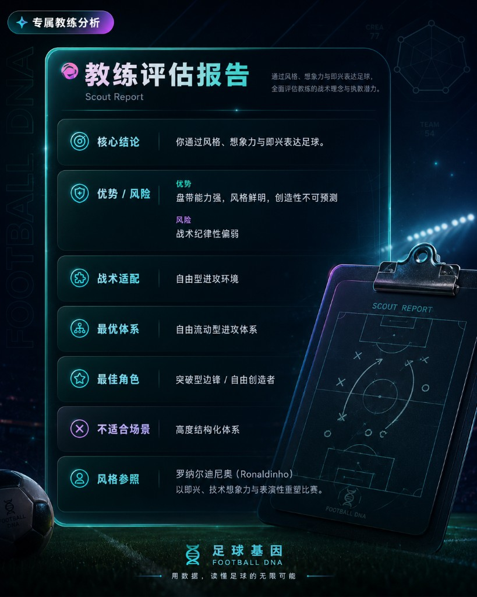
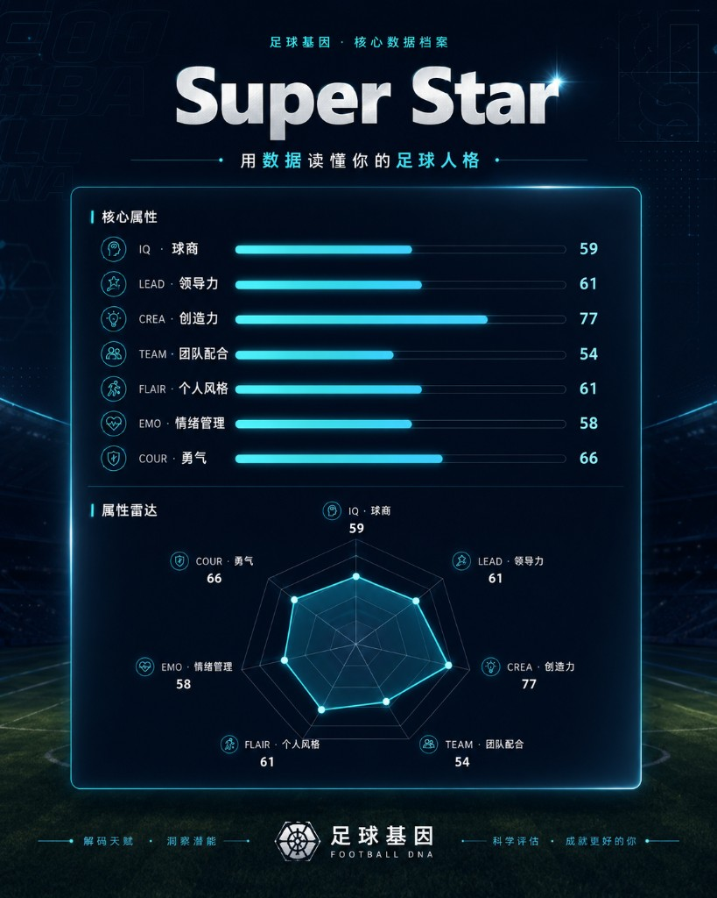

# Football DNA

**An MBTI-style football personality quiz — discover your on-pitch archetype in 30 match moments.**

[Live (International)](https://soccer-mbti.kickquiz.workers.dev) · [Live (China)](http://football-mbti.cn) · English / 中文 · [MIT License](LICENSE)

<p align="center">
  
</p>

---

## Overview

Football DNA is a static, client-side web app that maps how you react on the pitch to one of **10 football archetypes**. Answer **30 scenario-based questions** (fast breaks, set pieces, World Cup knockouts, dressing-room moments, and more), then receive a rich result profile with scout report, attribute radar, shareable player card, and platform-specific share captions.

All scoring runs in the browser — no backend is required to take the quiz.

| | |
|---|---|
| **Questions** | 30 (shuffled per session) |
| **Archetypes** | 10 base types × 3 tiers (Prime / Core / Hybrid) |
| **Dimensions** | Football IQ, Leadership, Creativity, Teamwork, Flair (+ Emotional Control & Courage for radar) |
| **Languages** | English · 中文 |
| **Stack** | React 18 · Vite 5 · Tailwind CSS · Framer Motion |

---

## Screenshots

<p align="center">
  
  <br /><sub>Intro · 发现你的足球人格原型</sub>
</p>

<table align="center">
  <tr>
    <td align="center" width="50%">
      
      <br /><sub>Quiz · 30 个比赛瞬间</sub>
    </td>
    <td align="center" width="50%">
      
      <br /><sub>Result · 原型与世界杯故事线</sub>
    </td>
  </tr>
  <tr>
    <td align="center" width="50%">
      
      <br /><sub>Scout Report · 教练评估报告</sub>
    </td>
    <td align="center" width="50%">
      
      <br /><sub>Player Build · 核心属性与雷达图</sub>
    </td>
  </tr>
</table>

---

## Live demos

| Region | URL | Hosting |
|--------|-----|---------|
| International | https://soccer-mbti.kickquiz.workers.dev | Cloudflare Workers |
| China | http://football-mbti.cn | Aliyun OSS + custom domain |

> **Note:** Aliyun OSS default bucket URLs force-download HTML. A **custom domain** bound to the bucket is required for browser access in China.

---

## Features

### Quiz experience
- Immersive pitch-themed UI with progress tracking and prev/next navigation
- Bilingual questions and UI (toggle anytime)
- Question order randomized on each run

### Scoring engine
- **Pair-based lookup:** top two archetype dimensions → result tier from score gap
- **Vector similarity:** normalized 7-axis profile compared to prototype vectors for refined classification
- Automatic fallback if vector mapping is ambiguous

### Result page
- **Hero** — archetype name, MBTI-style code, inspired-by player
- **World Cup extras** — signature moment, best teammate, next upgrade
- **Scout report** — tactical role, strengths, growth areas
- **Player build** — 7-axis radar chart and core attributes
- **Completion stats** — global counter via Supabase (optional)
- **Share** — copy captions for WeChat, Xiaohongshu, Douyin, Dongqiudi; download PNG player card

---

## The 10 archetypes

| Code | EN | 中文 |
|------|----|------|
| FDNA-01 | The Defensive Commander | 防线指挥官 |
| FDNA-02 | The Offensive Brain | 进攻大脑 |
| FDNA-03 | The Deep Organizer | 后场组织者 |
| FDNA-04 | The Wing Threat | 边路爆点 |
| FDNA-05 | The Inspired Attacker | 灵感攻击手 |
| FDNA-06 | The Team Anchor | 球队后盾 |
| FDNA-07 | The Clutch Captain | 关键队长 |
| FDNA-08 | The Linking Core | 串联核心 |
| FDNA-09 | The Dribbling Magician | 盘带魔术师 |
| FDNA-10 | The Tempo Master | 节奏大师 |

Each archetype can resolve as **Prime**, **Core**, or **Hybrid** depending on how clearly your top dimensions separate.

---

## Quick start

### Prerequisites
- **Node.js 20+**
- **npm 9+**

### Install & run locally

```bash
git clone https://github.com/Boyuedu/football-mbti-quiz.git
cd football-mbti-quiz
npm ci
cp .env.example .env   # optional — see Environment variables
npm run dev
```

Open http://localhost:5173

### Build & preview production bundle

```bash
npm run build
npm run preview
```

Output is written to `dist/`.

---

## Environment variables

Copy `.env.example` to `.env` at the project root.

| Variable | Required | Description |
|----------|----------|-------------|
| `VITE_SUPABASE_URL` | Optional | Supabase project URL (`https://xxx.supabase.co`) — **not** the `/rest/v1/` API URL |
| `VITE_SUPABASE_ANON_KEY` | Optional | Supabase anon / publishable key; enables completion counter on result page |
| `ALIYUN_OSS_REGION` | Deploy only | e.g. `oss-cn-hongkong` |
| `ALIYUN_OSS_BUCKET` | Deploy only | OSS bucket name |
| `ALIYUN_OSS_ACCESS_KEY_ID` | Deploy only | RAM access key |
| `ALIYUN_OSS_ACCESS_KEY_SECRET` | Deploy only | RAM secret |
| `ALIYUN_OSS_PREFIX` | Optional | Folder prefix inside bucket (empty = root) |

Without Supabase vars, the quiz works fully; the completion counter is simply hidden.

### Supabase setup

1. Create a Supabase project.
2. Run the migration in `supabase/migrations/20250611000000_quiz_counter.sql` (SQL editor or CLI).
3. Add `VITE_SUPABASE_URL` and `VITE_SUPABASE_ANON_KEY` to `.env` before `npm run build`.

---

## Deployment

One build (`dist/`) is deployed to two regions for low latency worldwide.

### International — Cloudflare Workers

```bash
npm run build
npx wrangler login
npm run deploy:cloudflare
```

Config: `wrangler.toml` (`soccer-mbti`, SPA fallback via `not_found_handling`).

GitHub Actions: `.github/workflows/deploy-cloudflare.yml` (manual `workflow_dispatch`).

### China — Aliyun OSS

1. Create a **public-read** bucket with static website hosting (`index.html` + 404 → `index.html`, error response **200** for SPA).
2. Fill Aliyun vars in `.env`.
3. Deploy:

```bash
npm run deploy:china
```

4. Bind a **custom domain** in OSS → 传输管理 → 域名管理, then add the CNAME at your DNS provider.

GitHub Actions: `.github/workflows/deploy-china.yml` (auto on push to `main` when secrets are set).

Detailed guides:
- [Dual-region deployment](docs/deployment-dual-static.md)
- [Deploy with Git & GitHub Actions](docs/deploy-with-git.md)
- [Scoring weights reference](docs/scoring-weights-reference.md)

---

## Project structure

```
football-mbti-quiz/
├── src/
│   ├── app/                 # App shell & stage routing
│   ├── components/
│   │   ├── intro/           # Landing screen
│   │   ├── quiz/            # Question flow
│   │   ├── result/          # Result page modules
│   │   └── common/          # Language toggle, progress bar
│   ├── data/
│   │   ├── questions.js     # 30 quiz questions & dimension keys
│   │   ├── archetypes/      # Prototypes, results, scout reports
│   │   └── content/         # Result extra sections (World Cup, etc.)
│   ├── i18n/                # UI strings, localization helpers
│   └── lib/
│       ├── scoring/         # scoreAnswers, userVector, similarity
│       ├── share/           # Platform share formats & card export
│       ├── quiz/            # Question ordering, completion counter
│       └── supabase/        # Supabase client
├── scripts/
│   ├── deploy-aliyun-oss.mjs
│   └── export-weights.mjs
├── supabase/migrations/     # Completion counter SQL
├── docs/                    # Deployment & scoring docs
└── .github/workflows/       # CI deploy workflows
```

---

## Scripts

| Command | Description |
|---------|-------------|
| `npm run dev` | Start Vite dev server |
| `npm run build` | Production build → `dist/` |
| `npm run preview` | Preview `dist/` locally |
| `npm run deploy:cloudflare` | Build + deploy to Cloudflare Workers |
| `npm run deploy:china` | Build + upload to Aliyun OSS |
| `npm run export:weights` | Export scoring weight matrix (maintainers) |

---

## Tech stack

| Layer | Choice |
|-------|--------|
| UI | React 18, Tailwind CSS 3, Framer Motion |
| Build | Vite 5 |
| Analytics counter | Supabase (PostgreSQL + RPC) |
| International CDN | Cloudflare Workers (static assets) |
| China CDN | Aliyun OSS + custom domain |
| Optional API | `server/rating-api-example.js` (Express + SQLite demo) |

---

## Contributing

Contributions are welcome under the [MIT License](LICENSE).

- **Bug reports & ideas** — open a [GitHub issue](https://github.com/Boyuedu/football-mbti-quiz/issues)
- **Pull requests** — fork, branch, and PR; keep changes focused
- **Questions & translations** — issues are fine for discussion before large edits

---

## 中文简介

**Football DNA（足球 DNA）** 是一款 MBTI 风格的足球人格测试：30 道真实比赛情境题，测出你的 **10 大球员原型** 之一，并生成教练报告、七维雷达图、可下载球员卡和多平台分享文案。

| 链接 | 说明 |
|------|------|
| [海外版](https://soccer-mbti.kickquiz.workers.dev) | Cloudflare 全球加速 |
| [国内版](http://football-mbti.cn) | 阿里云 OSS + 自定义域名 |

本地开发：`npm ci && npm run dev`  
国内部署详见 [docs/deployment-dual-static.md](docs/deployment-dual-static.md)

---

## License

This project is licensed under the **MIT License** — see [LICENSE](LICENSE).

You may use, modify, and distribute the code with attribution. Quiz copy, archetype content, and branding remain part of the project; derivative works should retain the copyright notice.

---

## Acknowledgements

Inspired by football culture and MBTI-style personality frameworks. Player references and archetype copy are for entertainment and self-reflection — not clinical or professional assessment.

---

<p align="center">
  <sub>Built with ⚽ for the World Cup season</sub>
</p>
